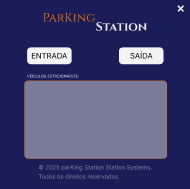
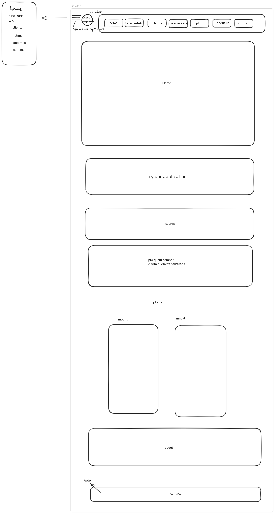
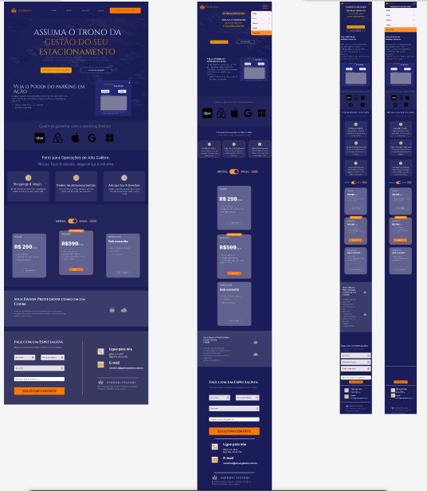

# 👑 Parking Station: Gestão de Estacionamentos de Alto Calibre

## Visão Geral do Projeto

Este repositório contém o **Projeto Integrador** desenvolvido por nós, alunos alunos do senai. O projeto consiste em uma solução completa de gestão de estacionamentos, incluindo um **Software de Gestão** e uma **Landing Page de Divulgação** que promove o produto e atrai clientes.

Nosso foco foi em criar um sistema de **Interativo, simples e com um Desing incrivel**.

## Tecnologias Utilizadas

| Componente | Linguagem | Descrição |
| :--- | :--- | :--- |
| **Software de Gestão** | Java | Desenvolvimento da aplicação principal de gerenciamento de entradas, saídas e veículos estacionados. |
| **Landing Page** | HTML, CSS, JavaScript | Criação da página de divulgação responsiva e com foco em conversão. |
| **Protótipos** | Excalidraw, Figma | Ferramentas utilizadas para esboços de baixa fidelidade e protótipos de alta fidelidade. |
| **Infraestrutura** | Servidor Web, DNS | Configuração do ambiente de produção para *hosting* da Landing Page. |

## 🖥️ Componentes do Projeto

### 1. Landing Page de Divulgação
(Desenvolvedor: **Matheus Henry**)

A Landing Page foi projetada para ser a vitrine do **Parking Station**, destacando seus benefícios e casos de uso (Shoppings, Redes de Estacionamentos e Aeroportos & Eventos).

* **Estrutura de Arquivos:**
```
landing-page/
├── img/              # Imagens do site
│             
├── css/              # Todos os arquivos de estilo
│   ├── reset         # Estilos básicos e globais
│   └── style         # Estilização da página completa
│                  
├── js/               # Scripts JavaScript
│   └── script        # Componentes JavaScript
│          
└── html              # Arquivos HTML do site
	  └── index         # Estrutura completa da landing-page
```
**Prévia da Landing Page:** <br>


### Software de Gestão (Java)
(Desenvolvedor: **Enzo Crepaldi**)

O coração do projeto, este *software* é a ferramenta que o operador utiliza para gerenciar o fluxo de veículos no estacionamento. Ele registra entradas, saídas e mantém um inventário dos veículos estacionados em tempo real.

**Prévia da Interface do Software:** <br>


### Documentação e Protótipos

A seção de documentação inclui artefatos cruciais para o desenvolvimento, como os protótipos de baixa e alta fidelidade e os registros de *dailys* (reuniões diárias), onde discutimos o que faríamos, o que fizemos, o que estamos fazendo e se precisávamos de ajuda."

* **Comentário do TechLead (Francisco Wala):**
    > "Para chegar no protótipo final, foi necessário passar pelo esboço (Excalidraw), logo em seguida foi necessário realizar mudanças e chegamos no atual."

| Fidelidade | Descrição |
| :--- | :--- |
| **Baixa Fidelidade** | Foco na estrutura e fluxo básico da página. <br>  |
| **Alta Fidelidade** | Design detalhado com cores, tipografia e elementos visuais finais, representando o produto pronto. <br> |

### Deploy e Configuração de DNS

A Landing Page foi hospedada em um servidor *web* e configuramos um DNS para que o domínio do projeto aponte corretamente para o servidor.

### Arquitetura de Redes 

Através do Packet Tracer criamos um rede pequena para hospedar uma versão mais leve da nossa Landing page.

---

## 👥 Equipe de Desenvolvimento

| Membro | Função Principal |
| :--- | :--- |
| **Matheus Henry** | Desenvolvimento da Landing Page/ Pórem deu apoio em tudo |
| **Enzo Crepaldi** | Desenvolvimento do Software de Gestão (Java)/ Pórem deu apoio em tudo |
| **Francisco Wala** | TechLead, Documentação e Protótipos/ Pórem deu apoio em tudo |

---

## 🛠️ Como Executar o Projeto Localmente

Para rodar a Landing Page localmente, siga os passos abaixo:

1.  **Fork o repositório:**
    ```bash
    Fork
    ```
2.  **Navegue até a pasta da Landing Page:**
    ```bash
    cd Projeto_Integrador/landing-page/
    ```
3.  **Abra o arquivo `index.html`** no seu navegador de preferência.
